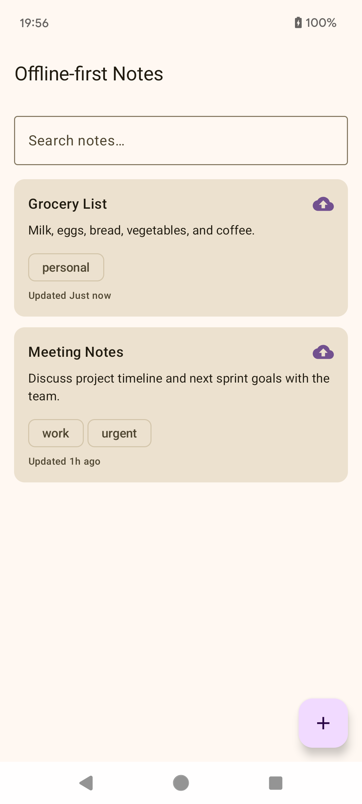
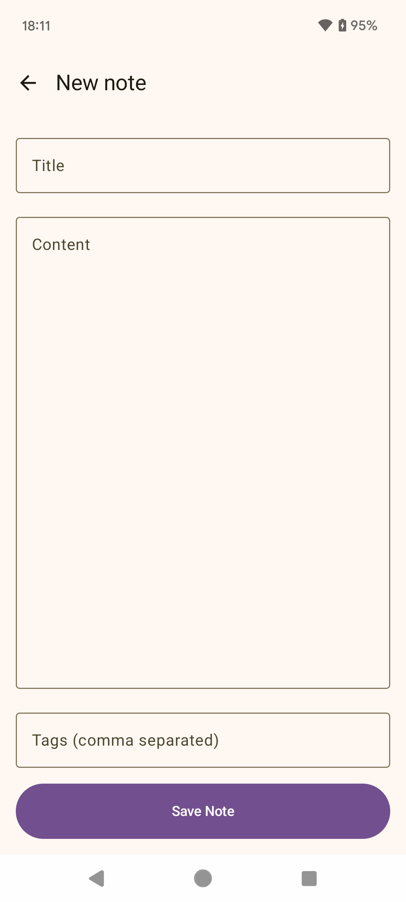
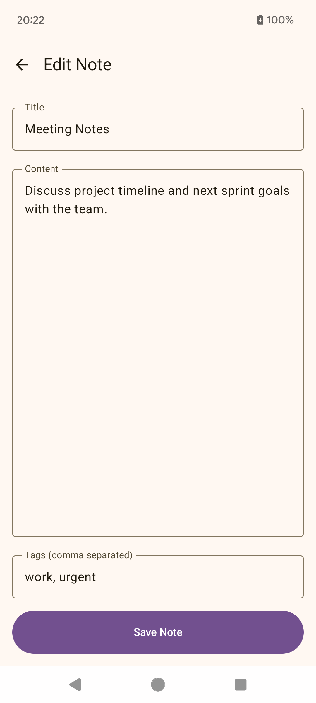

# Offline-First Notes App

A modern Android demonstration app showcasing **offline-first architecture**, two-way synchronization with Firebase Firestore, and Clean Architecture using Jetpack Compose.

Built with Room as the single source of truth, background sync via WorkManager, and conflict resolution using Last-Write-Wins strategy.

---

# Screenshots

| Note List (with pending sync) | Note Editor (New) | Note Editor (Edit) |
|-------------|-------------|----------------|
|  |  |  |

---

# Features

* Fully offline-first note creation and editing
* Realtime search by title and content
* Tag support with chips UI
* Pending sync indicator with manual sync option
* Soft delete with two-way sync (local + Firebase)
* Automatic background sync using WorkManager
* Last-Write-Wins conflict resolution for multi-device support
* Initial pull from Firebase when local database is empty

---

# Data Flow

Room acts as the **single source of truth**.

```
UI (Compose)
↓
ViewModel
↓
RepositoryImpl
├── Local (Room) ← Single Source of Truth
└── Remote (Firestore) ← Background sync
```
---

# Tech Stack

* Kotlin + Jetpack Compose
* Clean Architecture
* MVVM + StateFlow
* Room Database (Single Source of Truth)
* Firebase Firestore
* WorkManager + Constraints
* Hilt (Dependency Injection)
* Navigation Compose + Hilt Navigation
* Kotlin Coroutines + Flow

---

# Project Structure
```
data
├─ local (Room)
├─ remote (Firestore)
├─ repository
└─ sync (WorkManager)
domain
├─ model
├─ repository (interface)
└─ (No UseCase - kept simple for demo)
presentation
├─ navigation
├─ notes (List + Editor)
└─ theme
```
---

# Author

Luong Ho  
Android Developer